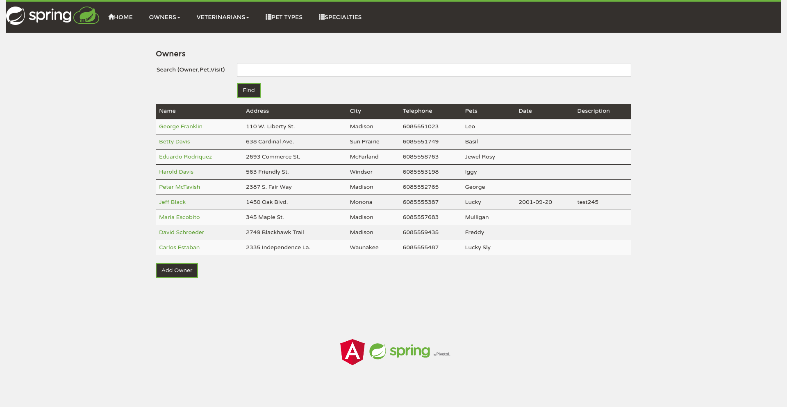

# Spring Petclinic Angular (forked from Original:[spring-petclinic-angular](https://github.com/spring-petclinic/spring-petclinic-angular/))

[](https://github.com/UserViktor/WPM_WISE21-22_spring-petclinic-angular/actions/workflows/angular-ci.yml)
[](https://github.com/UserViktor/WPM_WISE21-22_spring-petclinic-angular/actions/workflows/cypress.yml)
[](https://github.com/UserViktor/WPM_WISE21-22_spring-petclinic-angular/actions/workflows/deployment.yml)

## Angular frontend for Spring Petclinic

Warning: **client only**. 
  Use REST API from backend [WPM_WISE21-22_spring-petclinic-rest project](https://github.com/UserViktor/WPM_WISE21-22_spring-petclinic-rest)
  You need start backend server before start frontend application.

## Screenshot

  

## Installation

1. Update angular-cli to latest version
as described on [angular-cli github readme.md](https://github.com/angular/angular-cli#updating-angular-cli)

````
npm uninstall -g angular-cli @angular/cli
npm cache clean
npm install -g @angular/cli@latest
````
Clone project from github
````
git clone https://github.com/UserViktor/WPM_WISE21-22_spring-petclinic-angular.git
````
Install local project package
````
npm install --save-dev @angular/cli@latest
npm install
````

You can see current dependencies in [package.json](package.json) file.

## Development server

Run `ng serve` for a dev server. Navigate to `http://localhost:4200/`. The app will automatically reload if you change any of the source files.

## Code scaffolding

Run `ng generate component component-name` to generate a new component. You can also use `ng generate directive|pipe|service|class|module`.

## Build

Run `ng build` to build the project. The build artifacts will be stored in the `dist/` directory. Use the `-prod` flag for a production build.

## Documentation

The documentation of the Spring Petclinic Angular application is generated by the [compodoc](https://compodoc.app) tool.

Original Documentation URL: [https://spring-petclinic.github.io/spring-petclinic-angular/](https://spring-petclinic.github.io/spring-petclinic-angular/)

Access the Documentation by calling the [index.html](/docs/index.html) locally.

Regenerate the `docs` folder with [compodoc](https://compodoc.app):
### prerequisites compodoc
```
npm install -g @compodoc/compodoc
```
### Rebuild docs
```
compodoc -p src/tsconfig.app.json -d docs
```


## Deploy on Web servers

### Deploy on Nginx (for Nginx CentOS installation):

1. Build Angular application:

  ng build --prod --base-href=/petclinic/ --deploy-url=/petclinic/

2. Create sub-directory **/petclinic** in default nginx directory **/usr/share/nginx/html**

3. Copy **/dist**  sub-directory from Angular appication to  **/usr/share/nginx/html/petclinic**

4. Edit nginx config (nginx.conf file in /etc/nginx/ directory)

```
server {
	listen       80 default_server;
        root         /usr/share/nginx/html;
        index index.html;

	location /petclinic/ {
                alias /usr/share/nginx/html/petclinic/dist/;
                try_files $uri$args $uri$args/ /petclinic/index.html;
        }
}
```

5. Reload nginx:  **nginx -s reload**

6. Run app in browser:  http://server_name/petclinic/

### Deploy on Apache (for Apache CentOS installation):

1. Build Angular application:

ng build --prod --base-href=/petclinic/ --deploy-url=/petclinic/

2. Create sub-directory **/petclinic** in default Apache directory **/var/www/html**

3. Go into Angular appication **/dist** sub-directory and copy all files and sub-dirs from it to **/var/www/html/petclinic**

4. Edit Apache config (/etc/https/conf/httpd.conf):

sudo vi /etc/httpd/conf/httpd.conf

Find the Directory /var/www/html> section and change the AllowOverride directive from None to All:
```
 /etc/httpd/conf/httpd.conf
 . . .
  <Directory /var/www/html>
 . . .
 # 
 # AllowOverride controls what directives may be placed in .htaccess files.
 # It can be "All", "None", or any combination of the keywords:
 # Options FileInfo AuthConfig Limit
 #
 AllowOverride All
 . . .
 </Directory>
 . . .
```
5. Save and exit the file and then restart Apache to apply the change:

sudo systemctl restart httpd

6. Create a .htaccess file in the directory **/var/www/html/petclinic**

sudo vi /var/www/html/petclinic/.htaccess

Add the following line to the top of the file to activate the RewriteEngine, which instructs Apache to process any rules that follow:
```
RewriteEngine On  
# If an existing asset or directory is requested go to it as it is
RewriteCond %{DOCUMENT_ROOT}%{REQUEST_URI} -f [OR]  
RewriteCond %{DOCUMENT_ROOT}%{REQUEST_URI} -d  
RewriteRule ^ - [L]

# If the requested resource doesn't exist, use index.html
RewriteRule ^ index.html  
```
7. Reload Apache:

sudo systemctl restart httpd

8. Run app in browser: http://server_name/petclinic/

## Running unit tests

Run `ng test` to execute the unit tests via [Karma](https://karma-runner.github.io).

## Running end-to-end tests

There are 3 ways of how to start the cypress tests(REST version/backend must be running):
1. Run `ng serve` to start the angular application, afterwards run `./node_modules/.bin/cypress open` to start [Cypress](http://www.cypress.io/) and then execute the end-to-end tests.
2. Run `ng e2e --headless --no-watch` to run the end-to-end tests headless. 
3. Run `ng e2e` to run the angular application and automaticly afterwards to start [Cypress](http://www.cypress.io/) and then execute the end-to-end tests.

## Further help

To get more help on the Angular CLI use `ng help` or go check out the [Angular CLI README](https://github.com/angular/angular-cli/blob/master/README.md).
